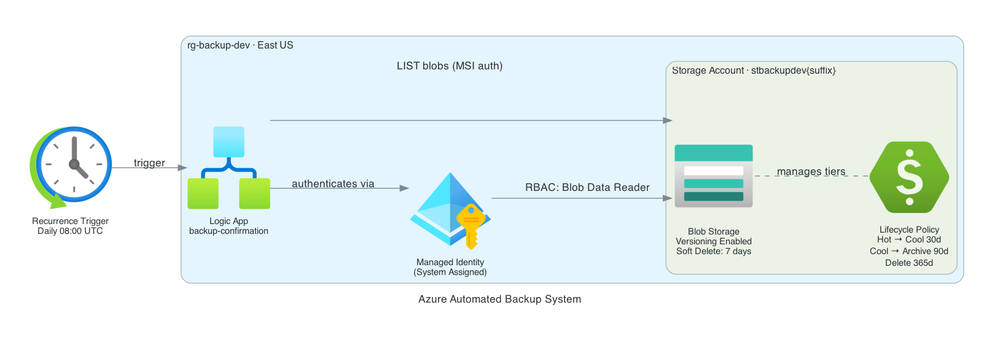

# Azure Automated Backup System

Terraform-managed Azure infrastructure that provisions a blob storage backup vault with automated daily verification via Logic App. Uses managed identity for keyless authentication, blob versioning for point-in-time recovery, and tiered lifecycle management to minimize storage costs.

## Architecture



| Component | Resource | Purpose |
|---|---|---|
| Logic App | `logic-backup-confirmation-{env}` | Daily workflow triggered at 08:00 UTC |
| Managed Identity | System-assigned on Logic App | Keyless auth to Blob Storage (no credentials stored) |
| Blob Storage | `stbackup{env}{suffix}` | Backup vault — versioning + soft delete enabled |
| Lifecycle Policy | Management policy on storage account | Automatic cost tiering over time |
| RBAC | Storage Blob Data Reader | Least-privilege access from Logic App to storage |

## Features

- **Blob versioning** — every overwrite creates a recoverable version
- **Soft delete** — 7-day recovery window for deleted blobs and containers
- **Lifecycle tiering** — Hot → Cool (30d) → Archive (90d) → Delete (365d) for base blobs; versions archived after 7d, deleted after 90d
- **Managed identity auth** — Logic App authenticates to Blob Storage via MSI, no API keys or connection strings
- **Daily verification** — Logic App lists blobs each morning to confirm the container is healthy
- **Optional email alerts** — SendGrid HTTP action fires after a successful blob list (set `sendgrid_api_key` to enable)
- **OIDC CI/CD** — GitHub Actions authenticates to Azure via federated identity, no stored credentials

## Prerequisites

- Azure subscription with `Contributor` + `User Access Administrator` on the target scope
- Azure Storage account for Terraform remote state (see [Backend Setup](#backend-setup))
- Terraform >= 1.6
- Azure CLI (for local runs)

## Backend Setup

The Terraform state is stored in Azure Blob Storage. Create the backend resources once:

```bash
az group create --name rg-tfbackend-jordprojs --location eastus
az storage account create \
  --name sttfbejordprojs8557 \
  --resource-group rg-tfbackend-jordprojs \
  --sku Standard_LRS \
  --min-tls-version TLS1_2
az storage container create \
  --name tfstate \
  --account-name sttfbejordprojs8557 \
  --auth-mode login
```

## Deploy

```bash
# Authenticate
az login

# Initialize (pulls remote state)
cd terraform
terraform init

# Plan — alert_email is required; sendgrid_api_key is optional
terraform plan \
  -var="alert_email=you@example.com" \
  -var="sendgrid_api_key=SG.xxxx"  # omit to skip email

# Apply
terraform apply \
  -var="alert_email=you@example.com"
```

## Seed and Test

Upload sample backups to the container to exercise the system:

```bash
# Get the storage account name from Terraform output
STORAGE=$(terraform output -raw storage_account_name)

bash ../scripts/seed_backup.sh "$STORAGE"
```

To trigger the Logic App manually and verify it runs:

```bash
RG=$(terraform output -raw resource_group_name)
LA=$(terraform output -raw logic_app_name)

az rest --method post \
  --url "https://management.azure.com/subscriptions/<SUB_ID>/resourceGroups/${RG}/providers/Microsoft.Logic/workflows/${LA}/triggers/daily-backup-check/run?api-version=2016-06-01"

# Check run status
az rest --method get \
  --url "https://management.azure.com/subscriptions/<SUB_ID>/resourceGroups/${RG}/providers/Microsoft.Logic/workflows/${LA}/runs?api-version=2016-06-01&\$top=1" \
  --query "value[0].{status:properties.status,startTime:properties.startTime}"
```

## Variables

| Variable | Default | Description |
|---|---|---|
| `location` | `eastus` | Azure region |
| `environment` | `dev` | Environment tag suffix |
| `alert_email` | required | Destination for backup confirmation emails |
| `sendgrid_api_key` | `""` | SendGrid API key — email action is skipped if empty |
| `soft_delete_retention_days` | `7` | Blob and container soft-delete window |
| `cool_tier_after_days` | `30` | Days since last modification before moving to Cool |
| `archive_tier_after_days` | `90` | Days since last modification before moving to Archive |
| `delete_after_days` | `365` | Days since last modification before deletion |

## CI/CD

GitHub Actions deploys via OIDC (no stored credentials). Configure the following repository secrets:

| Secret | Description |
|---|---|
| `AZURE_CLIENT_ID` | App registration client ID (federated credential) |
| `AZURE_TENANT_ID` | Azure AD tenant ID |
| `AZURE_SUBSCRIPTION_ID` | Target subscription ID |
| `ALERT_EMAIL` | Passed to `terraform plan -var` |
| `SENDGRID_API_KEY` | Passed to `terraform plan -var` (optional) |

Push to `main` triggers plan + apply. Pull requests run plan only.

## Outputs

| Output | Description |
|---|---|
| `resource_group_name` | Name of the resource group |
| `storage_account_name` | Storage account name (includes random suffix) |
| `backup_container_name` | Blob container name (`backups`) |
| `logic_app_name` | Logic App workflow name |
| `logic_app_id` | Full resource ID of the Logic App |

## Tech Stack

- **Terraform** `>= 1.6` · `azurerm ~> 3.100` · `random ~> 3.0`
- **Azure Blob Storage** — Standard LRS, TLS 1.2+, versioning, soft delete, lifecycle management
- **Azure Logic Apps** (Consumption) — recurrence trigger, HTTP actions, managed identity auth
- **Azure RBAC** — Storage Blob Data Reader scoped to storage account
- **GitHub Actions** — OIDC federated auth, `hashicorp/setup-terraform@v3`
